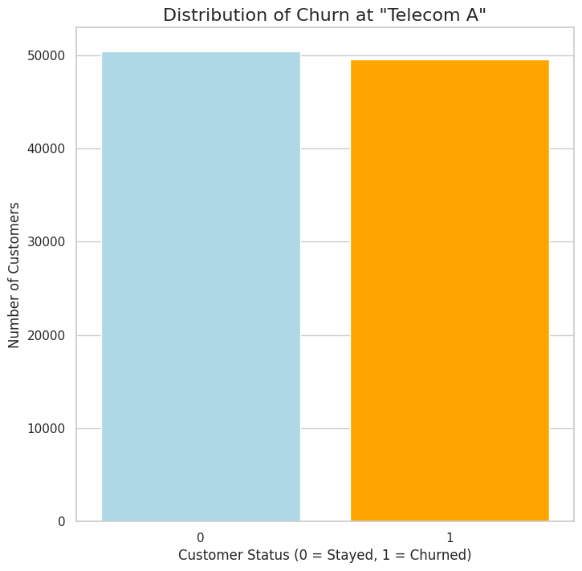
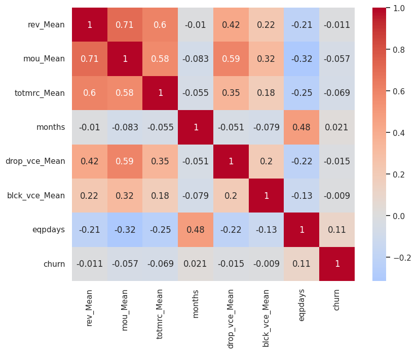
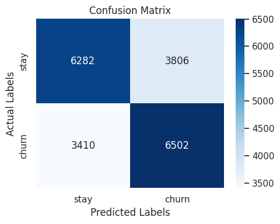
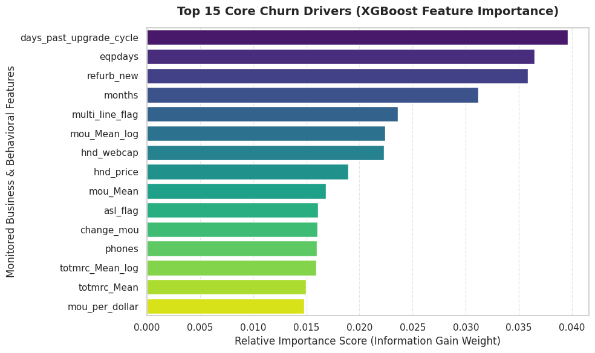
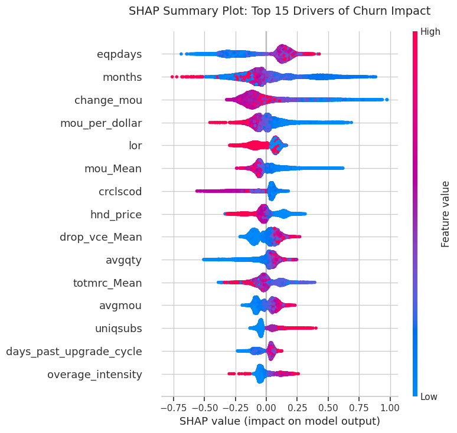
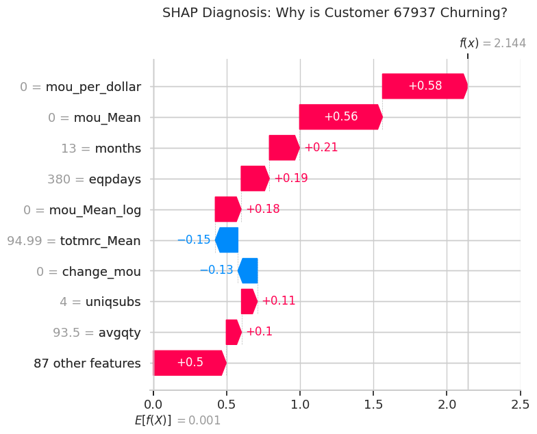

# 📱 Telecom Customer Churn Prediction using XGBoost

> End-to-end machine learning project that predicts customer churn for a telecommunications company using business-driven feature engineering, XGBoost, and SHAP explainability.


---

# Overview

Customer churn is one of the most expensive challenges faced by telecommunications companies.

This project develops an end-to-end machine learning pipeline capable of identifying customers at high risk of cancelling their subscription before they leave.

Rather than focusing only on prediction accuracy, the project emphasizes business understanding, feature engineering, model explainability, and actionable business recommendations.

The final solution predicts churn using XGBoost and explains every prediction through SHAP, allowing decision makers to understand both **who is likely to churn and why**.



---

# Business Problem

Acquiring a new customer costs significantly more than retaining an existing one.

The objective is therefore to predict which customers are most likely to churn 30–60 days in advance so retention campaigns can target only customers with the highest probability of leaving.

---

# Dataset

- **100,000 customers**
- **100 original features**
- Customer demographics
- Billing information
- Usage patterns
- Network quality metrics
- Device information
- Household characteristics

---

# Project Workflow

```text
Business Understanding
        │
        ▼
Data Integration
        │
        ▼
Data Cleaning
        │
        ▼
Exploratory Data Analysis
        │
        ▼
Feature Engineering
        │
        ▼
XGBoost Training
        │
        ▼
Model Evaluation
        │
        ▼
SHAP Explainability
        │
        ▼
Business Recommendations
```

---

# Exploratory Data Analysis

The exploratory analysis investigated which customer characteristics were associated with churn.

Major findings included:

- Older mobile devices strongly increase churn probability.
- Customers with low usage tend to churn more frequently.
- Multi-line households are considerably more unstable.
- Revenue alone is not a reliable churn indicator.
- Network quality had less impact than expected.
- Geographic differences exist but are relatively small.



---

# Feature Engineering

Instead of relying exclusively on the original variables, several business-oriented features were engineered.

| Feature | Purpose |
|----------|----------|
| mou_per_dollar | Measures perceived value for money |
| days_past_upgrade_cycle | Captures hardware upgrade timing |
| multi_line_flag | Identifies household plans |
| overage_intensity | Quantifies excessive network usage |
| Log transformations | Reduces skewness in financial variables |

---

# Machine Learning Model

Model:

- XGBoost Classifier

Main characteristics:

- Gradient Boosting Trees
- Early Stopping
- Regularization
- Class weighting
- Business-driven feature selection

Evaluation Metrics:

- ROC-AUC
- Precision
- Recall
- F1-score
- Confusion Matrix

---

# Results

| Metric | Score |
|---------|-------|
| ROC-AUC | **0.696** |
| Accuracy | **64%** |
| Precision | **0.63** |
| Recall | **0.66** |

The model successfully captures complex nonlinear relationships between customer behavior and churn while maintaining balanced predictive performance.





---

# Explainable AI (SHAP)

One of the primary goals of this project was to make the model interpretable.

SHAP was used to explain both:

- Global feature importance
- Individual customer predictions

This allows business stakeholders to understand exactly why a customer receives a high churn probability.

The strongest churn drivers identified by SHAP include:

- Device age
- Days past upgrade cycle
- Monthly usage
- Value for money
- Household structure




---

# Business Impact

Instead of ending with a prediction model, the project translates model outputs into business actions.

Two retention strategies were proposed:

### Device Upgrade Campaign

Identify customers using aging devices and proactively offer discounted upgrades before competitors do.

### Plan Right-Sizing

Recommend more appropriate plans to low-usage customers paying for expensive subscriptions.

These interventions create targeted retention campaigns instead of offering discounts to the entire customer base.

---

# Repository Structure

```text
telecom-churn-prediction/

│
├── notebooks/
│      Telecom_Churn.ipynb
│
├── images/
│      eda/
│      model/
│      shap/
│
├── requirements.txt
│
├── LICENSE
│
└── README.md
```

---

# Technologies

- Python
- Pandas
- NumPy
- Matplotlib
- Seaborn
- Scikit-Learn
- XGBoost
- SHAP

---

# Key Skills Demonstrated

- Data Cleaning
- Exploratory Data Analysis
- Feature Engineering
- Predictive Modeling
- Explainable AI
- Business Analytics
- Data Visualization
- Model Evaluation
- Customer Churn Prediction

---

# Future Improvements

- Cross-validation
- Hyperparameter optimization using Optuna
- Streamlit deployment
- FastAPI prediction endpoint
- Docker containerization
- CI/CD pipeline
- MLflow experiment tracking

---

# Author

**Mathias Vigil**

Computer Engineering Student

Universidad de la Republica (Uruguay)

GitHub: https://github.com/MathiasVigil

LinkedIn: https://linkedin.com/in/mathiasvigil